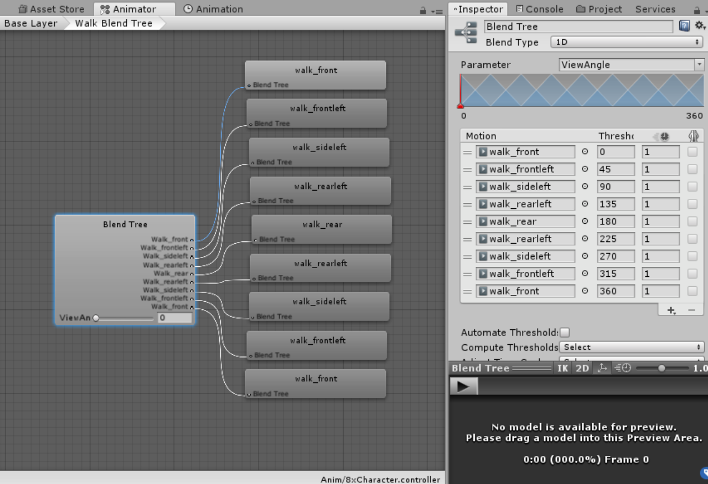

# DoomStyleAnimatedBillboard
Animated billboard with multiple view angles

## Features
+ Uses Sprite Renderer instead of textures
+ Uses the Animator blend trees for the multi directional animations.
+ Two types of billboard sprites. One using a shader and one without.

## License
+ MIT License

## Third Party Assets
+ Sprites: https://github.com/freedoom/freedoom
+ Ground Texture: https://github.com/unitycoder/DoomStyleBillboardTest
+ Billboard logic based on: https://github.com/Interkarma/daggerfall-unity

## Credits
+ Shader code developed by Risthart - https://github.com/Risthart